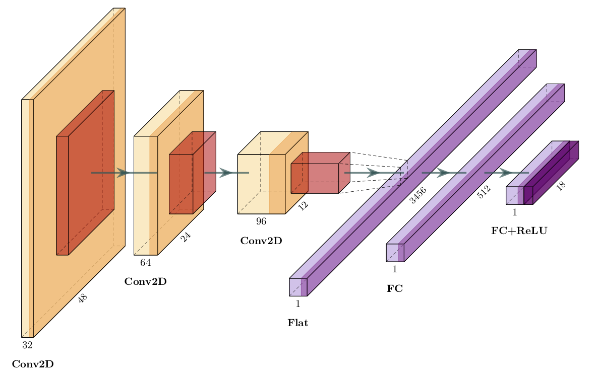

# UW Neural Data Challenge 2019

The challenge was to predict the responses of visual neurons to given images.

Read more about this Kaggle challenge [here](https://www.kaggle.com/c/uwndc19).


## The Final Model Architecture



The model receives an image of size 48x48x3 as input and returns 18 continuous 
values that correspond to a square root of a number of spikes for each neuron.

It was trained on 521 example, 20 examples were used for evaluation. During the training saturation of each 
image was changed every epoch by a random factor picked in the interval [0.7, 1.3]. Find more details 
about the training in the model's [configuration file](configs/multiclass/final-model.yaml).


## Some Thoughts

A model consisting of convolutional layers followed by dense layers was an obvious choice for this type of problem.
The main issue was a small dataset, and, as result, overfitting of training data.

#### Regularization

To reduce an overfitting, the model should be carefully regularized, but not too much, otherwise it will decrease
a model performance. I did a lot of experiments with dropouts, L2 regularizations and batch normalizations, 
and eventually ended up regularizing only dense layers using dropout.

#### Data Augmentation

Another technique to help a model generalize better is to get more data. Of course, we cannot get more real data, 
but we could try to generate it by distorting original images.

Introducing distortions to the images, there is a risk to remove some information that is crucial for the neurons 
spiking. So, we need to make an assumption that some distortions don't affect neurons perception and check this
hypothesis on evaluation data.

Unfortunately, the evaluation dataset is too small to say for sure that some distortions don't affect perception
and other do, but after some experiments I've concluded that the neurons don't care much about image 
saturation and rotations to small angles, but sensitive to vertical and horizontal flips.

The final model was trained on images that were modified every epoch by randomly changing their saturation. The 
second best model was trained with random saturation and, additionally, with rotations by a random angle in the 
interval [-0.1, 0.1] radians. I think, the rotation distortion didn't work very well, because the images are too 
small and interpolation after rotation actually changes some details on them.


## Model Configuration File

To train a new model you need to create a configuration file with hyper-parameters and training options. 
See an example of a configuration file for the final model [here](configs/multiclass/final-model.yaml).

Here is the format of the configuration file:

```yaml
# input data configuration
data:
  # number of example use for evaluation
  eval_size: 20
  
  # a random seed for the dataset shuffling
  random_seed: 130
  
  # a list of random distortions that should be applied to
  # an image during training. Keys in this dictionary correspond
  # to functions from the uwndc19.helpers.image_distortion_funcs module
  distortions:
    # flips image horizontally
    flip_left_right: {}
    
    # flips image vertically
    flip_up_down: {}
    
    # chooses one the angles and rotates an image
    rotate_choice:
      angles: [0, 45, 90]
      
    # chooses a random angle from -N to N degrees and rotates an image,
    # uses one of two interpolations: BILINEAR (by default) or NEAREST
    rotate:
      max_angle: 30
      interpolation: BILINEAR

    # randomly changes an image brightness
    brightness:
      max_factor: 0.1
      
    # randomly changes image saturation
    saturation:
      min_value: 0.8
      max_value: 1.2

# model configuration
model:
  # an input image will be cropped to this width and height
  image_size: 48

  # number of neurons
  num_classes: 18

  # a list of convolution layers
  conv_layers:
    - num_filters: 32          # number of convolutional filters
      kernel_size: 5           # kernel size
      padding: same            # padding: "same" or "valid"
      dropout_rate: 0.0        # dropout rate (0 by default)
      l2_regularization: 0.0   # L2 regularization factor (0 by default)

  # a list of dense layers
  dense_layers:
    - num_units: 512           # number of units
      dropout_rate: 0.4        # dropout rate (0 by default)
      l2_regularization: 0.0   # L2 regularization factor (0 by default)

  # a final logits layer
  logits_layer:
    dropout_rate: 0.4          # dropout rate (0 by default)
    l2_regularization: 0.0     # L2 regularization factor (0 by default)

# training configuration
training:
  eval_steps: 50               # do evaluation every N steps
  early_stopping_evals: 5      # stop training if RMSE was not improved after N evaluations
  learning_rate: 0.001         # learning rate
  keep_checkpoint_max: 3       # maximum number of checkpoints to keep
  export_best_models: true     # export models with the best RMSE
  exports_to_keep: 3           # number of the best models to keep
```


## Training

### Prerequsites

- Python >=3.5
- TensorFlow 1.12

The dataset files (`stim.npy` and `train.csv`) should be copied to the `data/` directory.

### Local training

1. Create a [configuration file](#model-configuration-file) for the model.

2. Run the training script:
    ```bash
    $ python uwndc19/scripts/train.py [-d MODEL_DIR] [-c CONFIG_PATH]
    ```
    By default, it will use the `configs/multiclass/default.yaml` configuration file and will save 
    checkpoints and logs to the `training/multiclass/local/test1` directory.

3. Start TensorBoard to monitor the training:
    ```bash
    $ tensorboard --logdir training/multiclass/local
    ```

### AWS training

A model can be trained on AWS using [Spotty](https://github.com/apls777/spotty).

1. Create a [configuration file](#model-configuration-file) for the model.

2. Run the following command from the project's directory to start an instance:
    ```bash
    $ spotty start
    ```

3. Use the "train" Spotty script to start training:
    ```bash
    $ spotty run train -p MODEL_NAME=<MODEL_NAME> -S
    ```
    By default, it will use the `configs/multiclass/default.yaml` configuration file. 
    See the [spotty.yaml](spotty.yaml) config for the details.

4. Start TensorBoard to monitor the training:
    ```bash
    $ spotty run tensorboard
    ```
    TensorBoard will be available on the port `6006`.

__Note:__ Spotty v1.2 is not officially released yet, but can be installed from the
the "dev-1.2" branch. You can clone the repo, checkout the "dev-1.2" branch and run the following
command to install it in the development mode:
```bash
$ pip install -e .
```


## Export Model

If the "export_best_models" parameter in the configuration file is set to "true", the best
models will be exported automatically during the training. You can find them in the 
`<MODEL_DIR>/export/best` directory.

Otherwise, you can use the following command to export a model from a custom checkpoint:
```bash
$ python uwndc19/scripts/export.py -d MODEL_DIR [-s CHECKPOINT_STEP]
```
If a checkpoint step is not specified, it will export the model using the latest checkpoint.

The model will be exported to the `<MODEL_DIR>/export/checkpoints/<TIMESTAMP>` directory.


## Predictions

See an example how to use an exported model to do predictions in the [predict.py](uwndc19/scripts/predict.py) file.

Make sure that the `data/` directory contains the `stim.npy` file and run the following command
to get predictions for the test dataset (first 50 images):

```bash
$ python uwndc19/scripts/predict.py
```


## Hyperparameters Tuning

For hyperparameter tuning I tried to use the [Tune](https://ray.readthedocs.io/en/latest/tune.html) framework.

To tune a model you should have 2 configuration files in the `configs/multiclass/hp_tuning/` directory:
1. A model configuration file that will be tuned: `config.yaml`.
2. A configuration file with possible "mutations": `mutations.yaml`.

### Mutations Configuration File

Here is an example of a configuration file with mutations:

```yaml
add_conv_layer:
  - num_filters: [128, 256]
    kernel_size: [3, 5]
   
  - num_filters: [196]
    kernel_size: [7]

change_conv_layer:
  - layer_id: [2]
    kernel_size: [3, 7]
```

Each key in this file is a mutation function, value is a list, where each element is a grid of parameters to search.
A combination of parameters from the grid becomes arguments for the corresponding mutation function. All mutation 
functions described in the [mutation_funcs.py](uwndc19/hp_tuning/mutation_funcs.py) file. 

For this particular example, 7 different mutations will be applied to a base configuration file: (128, 3), (128, 5), 
(256, 3), (256, 5), (196, 7) for the "add_conv_layer" function and (2, 3), (2, 7) for the "change_conv_layer"
function.

### Tuning

1. Make sure that the [tune.py](uwndc19/scripts/tune.py) file contains the right values for number of available 
CPUs and number of CPUs and GPUs to use for each trial:

    ```python
    ray_num_cpus = 4
    num_cpus_per_process = 1
    num_gpus_per_process = 0.5
    ```

2. Use the following command to tune hyperparameters:

    __Local:__
    ```bash
    $ python uwndc19/scripts/tune.py -g EXPERIMENT_GROUP -n EXPERIMENT_NAME
    ```
    
    __AWS:__
    ```bash
    $ spotty run tune -p EXPERIMENT=<EXPERIMENT_NAME>
    ```

3. Use TensorBoard to track the experiment:
    
    __Local:__
    ```bash
    $ tensorboard --logdir ray_results/<EXPERIMENT_GROUP>/<EXPERIMENT_NAME>
    ```

    __AWS:__
    ```bash
    $ spotty run tensorboard-ray
    ```
